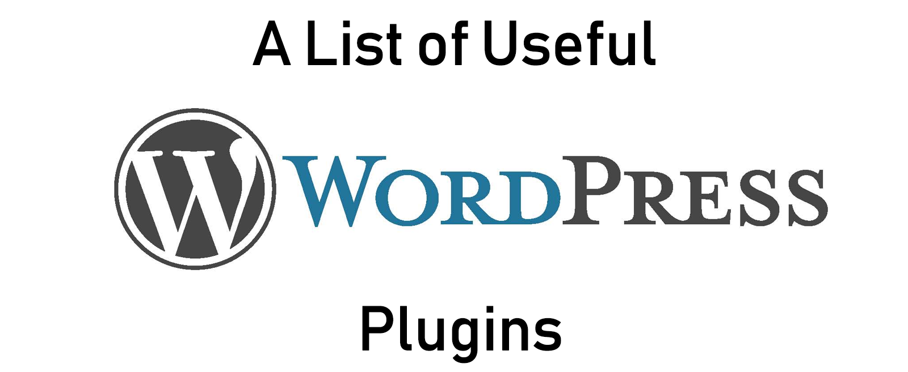

* Use <kbd>Ctrl</kbd> + <kbd>F</kbd> or <kbd>command</kbd> + <kbd>F</kbd> to search for a module.
* Contributions are welcome.

## HTML Form
* [`Contact Form 7`](https://contactform7.com) - It can manage multiple contact forms, plus you can customize the form and the mail contents flexibly with simple markup.
* [`WPForms`](https://wpforms.com/) - Drag & Drop WordPress Form Builder

## Security
* [`Sucuri`](https://wordpress.org/plugins/sucuri-scanner/) - Auditing, Malware Scanner and Security Hardening
* [`iThemes Security`](https://wordpress.org/plugins/better-wp-security/) - iThemes Security (formerly Better WP Security) gives you over 30+ ways to secure and protect your WordPress site.

## SEO
* [`Yoast SEO`](https://wordpress.org/plugins/wordpress-seo/) - Yoast SEO is the most complete WordPress SEO plugin. It handles the technical optimization of your site & assists with optimizing your content.

## Caching
* [`W3 Total Cache`](https://wordpress.org/plugins/w3-total-cache/) - W3 Total Cache improves the SEO and user experience of your site by increasing website performance, reducing download times via features like content delivery network (CDN) integration.
